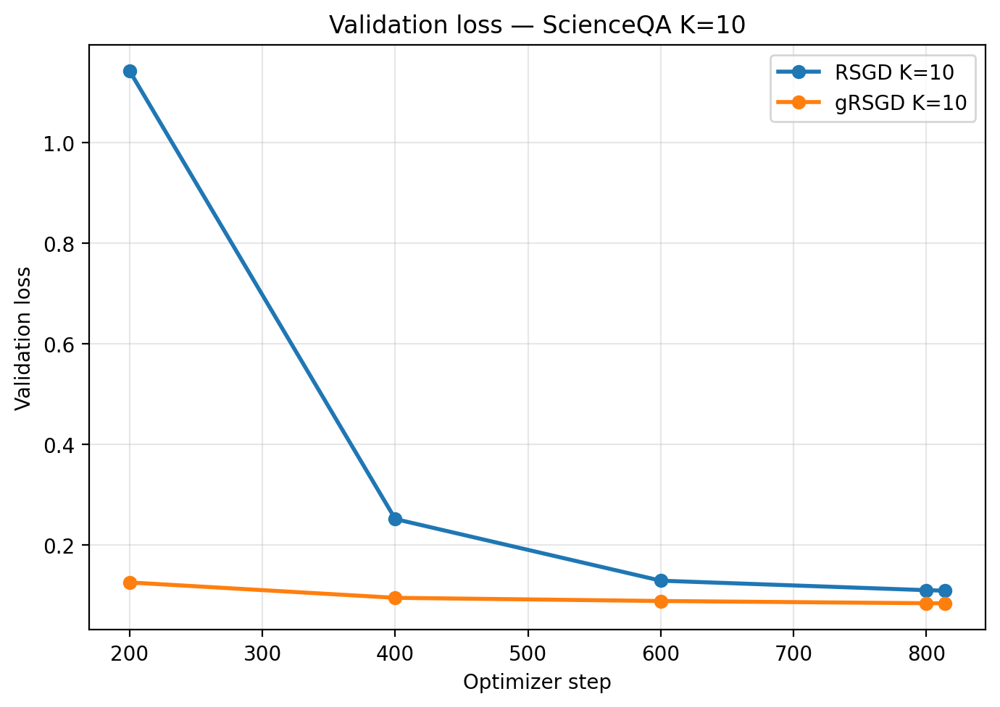

# MoE-LoRA Riemannian Reproduction

An independent reproduction study of **RSGD and gate-rescaled gRSGD for LLM
fine-tuning**, based on [A Stronger Mixture of Low-Rank Experts for Fine-Tuning
Foundation Models](https://arxiv.org/abs/2502.15828).
The authors' implementation is [THUDM/MoELoRA_Riemannian](https://github.com/THUDM/MoELoRA_Riemannian).

**Research question:** can gate rescaling alleviate weak expert updates and
improve optimization when fine-tuning MoE-LoRA? We study **Llama-3.2-3B on
text-only ScienceQA**, with [controlled synthetic experiments](experiments/synthetic/README.md)
to probe the mechanism.

## Core idea / Mechanism

MoE-LoRA combines low-rank expert outputs using token-dependent routing weights $g$.
With a fixed gate and upstream gradient, RSGD introduces one factor of $g$ in the expert gradient and another in the mixture output.
Its first-order expert contribution is therefore attenuated by $g^2$, making small-gate updates weak.

```math
\text{RSGD effective attenuation} \sim g^2,\qquad
\text{gRSGD expert backward factor}: g \rightarrow \sqrt{g}.
```

The implemented detach trick keeps the forward mixture unchanged while replacing the expert backward factor with $\sqrt{g}$.
At the same model state and upstream gradient, it also preserves the gate derivative.
This is a surrogate backward: the actual first-order forward change scales as $g^{3/2}$ in this local analysis, not automatically as $g$.
See the [paper's engineering approximation](https://arxiv.org/html/2502.15828v1#S3.SS3) and our [mechanism notes](experiments/synthetic/mechanism.md) for the distinction.

## Main result: text-only ScienceQA

The archived one-epoch K=10 runs use 20 experts, rank 4, microbatch 2,
gradient accumulation 4 and 814 optimizer steps. The test set contains
2,224 text-only examples.

| Method | Final validation loss | Test accuracy | Correct / total |
| --- | ---: | ---: | ---: |
| RSGD | 0.10825 | 71.18% | 1,583 / 2,224 |
| gRSGD | **0.08315** | **77.79%** | **1,730 / 2,224** |

**Observed accuracy difference: +6.61 percentage points** in this pair of runs.
Source: [final comparison](results/scienceqa/long_run/k10_longrun_final_comparison.csv).



*Recorded validation checkpoints; lines connect observations. Data:
[RSGD](results/scienceqa/long_run/rsgd_k10_e1_mb2_ga4.csv) and
[gRSGD](results/scienceqa/long_run/grsgd_k10_e1_mb2_ga4.csv).*

**Scope: reproduction in progress.** These are single-run historical observations,
with no multi-seed uncertainty estimate; they do not establish reproduction of
the paper's benchmark scores. The existing answer-target truncation issue and
other protocol gaps remain documented in [the reproduction notes](docs/reproduction.md).
The results and figure have not been regenerated for this documentation update.

## Mechanistic observations

- **Faster loss reduction in the recorded runs.** At optimizer step 200 in the
  K=10 run, validation loss is 0.12461 for gRSGD versus 1.14190 for RSGD. gRSGD
  stays lower at every recorded checkpoint. This supports faster convergence
  in optimizer steps for this setup, without establishing a wall-clock speedup
  or a general convergence guarantee ([histories](results/scienceqa/long_run/k10_longrun_comparison.csv)).
- **Higher K accompanies greater expert alignment in the short sweep.** At step
  100, increasing K from 4 to 8 raises output cosine from 0.1139 to 0.2109 for
  RSGD and from 0.1598 to 0.3191 for gRSGD. Reported update cosine also rises:
  0.0032 to 0.0078 and 0.0097 to 0.0483, respectively. These q-projection
  diagnostics suggest more similar expert outputs and update directions;
  they do not establish a causal or monotonic rule, and higher K does not
  improve final validation loss in these short runs
  ([Top-K diagnostics](results/scienceqa/topk/expert_diagnostics_comparison.csv)).
- **Gate entropy near 1 does not establish load balancing.** The normalized
  post-Top-K entropy $H(g)/\log K$ is about 0.995–0.996 in the short sweep.
  It measures how evenly a token weights its selected experts, not how often
  each expert is selected across tokens. The same K experts could receive
  equal weights for every token while the others receive no traffic. Load
  balancing requires separate per-expert routing counts
  ([metric definition](src/moelora_repro/scienceqa/diagnostics.py)).

[Hướng dẫn tiếng Việt](docs/workflow.vi.md) ·
[All LLM results](results/README.md) ·
[Protocols and limitations](docs/reproduction.md) ·
[Code layout](docs/structure.md)

## Run the LLM experiments

Python **3.10+**. From the repository root, preferably inside a virtual environment:

```bash
python -m pip install -e ".[scienceqa]"
```

Install the appropriate CUDA build of PyTorch for your machine. ScienceQA
training requires access to `meta-llama/Llama-3.2-3B` on Hugging Face and sufficient
GPU memory; the long-run driver explicitly requires CUDA. Keep access tokens in
your local Hugging Face login, outside this repository.

First inspect the effective configuration without downloading data or training:

```bash
python -m moelora_repro.run --config configs/scienceqa/long_grsgd_k10.json --dry-run
```

Run either method on a prepared GPU machine:

```bash
python -m moelora_repro.run --config configs/scienceqa/long_rsgd_k10.json
python -m moelora_repro.run --config configs/scienceqa/long_grsgd_k10.json
```

The pilot recipes run a shorter experiment. Override a supported parameter
without copying training code:

```bash
python -m moelora_repro.run --config configs/scienceqa/pilot_grsgd_k4.json --set top_k=8 --set seed=43
```

Each run creates a fresh `outputs/<recipe>/<run-id>/` directory with the effective
`recipe.json`, `manifest.json`, `console.log` and driver outputs. The manifest
records code/recipe commits, dirty-worktree flags, installed dependency versions,
command, timestamps and exit status. An explicit `--out` must name a new directory.
The installed `moelora-run` command is equivalent to `python -m moelora_repro.run`.

## Repository layout

| Location | Purpose |
| --- | --- |
| `src/moelora_repro/scienceqa/` | Main LLM implementation: adapters, optimization, data, diagnostics and training |
| `src/moelora_repro/run.py` | Common experiment launcher and provenance recording |
| `configs/scienceqa/` | LLM pilot and long-run recipes |
| `results/scienceqa/` | Curated historical LLM results |
| `experiments/synthetic/` | Supporting synthetic study, including its code, configs, results and documentation |
| `docs/` | Protocols, code layout and contributor workflow |
| `tests/` | Mechanism and workflow checks |
| `outputs/` | Local run outputs, ignored by Git |

`pyproject.toml` is the single source for package installation and dependencies.
Use the recipe launcher or the [documented module commands](docs/structure.md).

## Supporting synthetic checks

The small regression experiments isolate routing and optimizer behavior without
loading an LLM. Everything needed to inspect that study is in
[experiments/synthetic/](experiments/synthetic/README.md), including its two
archived result sets and detailed mechanism notes.

A CPU-only check from the repository root:

```bash
python -m pip install -e .
python -m unittest discover -s tests -v
python -m moelora_repro.run --config experiments/synthetic/configs/smoke.json
```

## Add the next LLM experiment

1. Create a named recipe in `configs/scienceqa/` and commit the code/configuration.
2. Run it through the launcher and inspect the saved status, metrics and diagnostics.
3. Copy a reviewed run into `results/scienceqa/<experiment>/` with its provenance.
4. Add a short interpretation using the [experiment template](docs/experiment-template.md)
   and register it in the [LLM results index](results/README.md).

Supporting synthetic recipes and curated results stay inside
`experiments/synthetic/`. See [the Vietnamese workflow](docs/workflow.vi.md).
